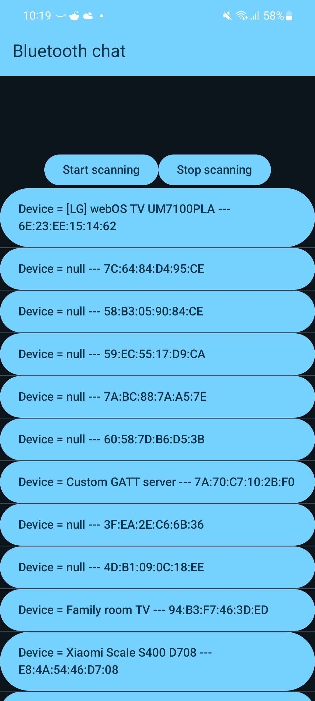

# Bluetooth chat
## _Android application to exchange text messages via bluetooth connection_

Bluetooth chatt is Android app that allows user to scan for bluetooth devices and connect to other device with this application intalled. Upon connection it opens chat and allows text messages to be
exchanged via bluetooth connection.

## Features

- scan for bluetooth devices
- connect to device with bluetoothchat installed and GATT server started
- send and receive text messages between devices (chat)

## Main screen
- start scanning for devices
- stop scanning the devices
- show discovered devices in a list on a screen
- here the device we are looking for is "Custom GATT server"

### Chat Screen
- send messages
- receive messages

